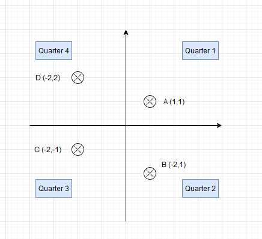

# Introduction to Java

## Simple variables

### Task 1

In class `Task1` create variables with types:
- int a 
- char b 
- double c
- long d
- bool e

Set them to proper values.


### Task 2
In `Task2` create another variable 
- `int magic` and set it's value to 2147483647.
- add one to it 

What happened?

### Task 3
```java
double y = 0.1;
double z = 0.2;
bool areEquals = y + z == 0.3;
```
 
Is `0.1 + 0.2` equal `0.3` (in Java)?

### Task 4
Print out in console:
`Tester was "super" excited due to the developer notoriously ignoring bug reports`
(watch out for quotes inside the string)

## Conditionals 
### Task 5
Create two variables:
- string name
- int age

Print a string in the format "Name, is X years old and is (under)age" depending on whether the age variable is less than 18 or not.

### Task 6
Use ternary operator to write it shorter:

```java
double alcoholContent = 5.5;
string beerType;
if (alcoholContent >= 4)
{
    beerType = "strong";
}
else
{
    beerType = "normal";
}
```

### Task 7
Switch - print the name of the week based on variable `int dayOfTheWeek`.

1 -> Monday, 2 -> Tuesday, ... , 7 -> Sunday


## Functions
### Task 8
Create method that takes price before discount, discount -> and returns price after discount.
```java
public static double calculatePrice(int price, double discount) {}
```

### Task 9
Create method that gets three numbers and returns the lowest of them
```java
public static double minFrom(double a, double b, double c) {}
```

### Task 10
Create method that gets three Strings and returns book details.
```java
public static String bookDetails(String title, String author, String illustrator) {}
```

For variables:
- `title=Hobbit`
- `author="J.R.R. Tolkien"` 
- `illustrator="David Wyatt"` 
 
method should return

`"Hobbit, written by J.R.R. Tolkien was illustrated by David Wyatt"`

### Task 11
The method is to accept four parameters (number, unit price, discount and the expected amount to the second decimal place). 
The number of products (pcs) multiplied by the unit price (price) minus the percentage discount on the total is to be equal
to the expected sum. The method is to return true (the expectedSum is correct) or false (the expectedSum is not correct)

Hint: Use Math.Round() to round the compared amounts to the nearest penny.
```java
public static bool validateSumWithDiscount(int pcs, double price, double discount, double expectedSum)
```

### Task 12
The GetQuadrant() method is supposed to take two parameters, the x and y coordinates of a point on the coordinate axis. 
It's supposed to return (use the switch function) the number of the quadrant on the coordinate system.

